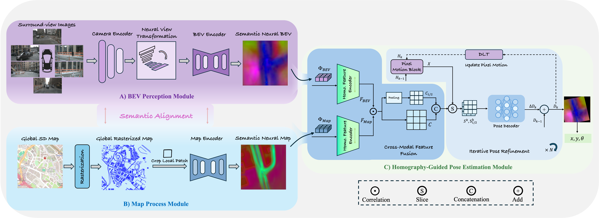

<p align="center">
  <h1 align="center"><i>HOLO</i>: Homography-Guided Pose Estimator Network for Fine-Grained Visual Localization on SD Maps</h1>
  <h3 align="center">CVPR 2026</h3>
  <p align="center">
                <span class="author-block">
                <a href="" target="_blank">Xuchang Zhong</a><sup>1</sup>,
              </span>
              <span class="author-block">
                <a href="" target="_blank">Xu Cao</a><sup>1</sup>,
              </span>
              <span class="author-block">
                <a href="" target="_blank">Jinke Feng</a><sup>2</sup>,
              </span>
              <span class="author-block">
                <a href="" target="_blank">Hao Fang</a><sup>1,§</sup>
              </span>
  </p>

  <p align="center">
    <sup>1</sup> Beijing Institute of Technology &nbsp;&nbsp;
    <sup>2</sup> University of Science and Technology of China &nbsp;&nbsp;
    <sup>§</sup> Corresponding Author
  </p>

  <p align="center">
    <a href="https://arxiv.org/abs/2601.02730"></a>
    <a href="https://drive.google.com/drive/folders/1Knq3lZxJr6QPe8qE9mIzaw57T7PH36xt?usp=sharing"></a>
  </p>

  <div align="center">
    
    <p align="left">
</p>
  </div>
</p>

##

This is the official repository of HOLO. HOLO is a multi-view pose estimation network for visual localization on SD maps. To address the inefficiency and unstable optimization of existing regression-based methods caused by the lack of explicit geometric guidance and unconstrained pose regression, HOLO introduces homography-based geometric priors to guide feature alignment and impose geometric constraints on pose estimation.

## 🚀 Getting Started

### Installation
First, clone the repository and create a data directory:

```bash
git clone https://github.com/Quartararo0714/HOLO
cd HOLO
```
Then, create conda environment with python 3.10 and intall the packages
```bash
conda create -n holo python=3.10
conda activate holo
pip install -r requirements.txt
```
To run the code with CUDA properly, you can comment out `torch` and `torchvision` in `requirements.txt`, and install the matching CUDA build of `torch==2.0.0+cu117` and `torchvision==0.15.0+cu117` (the versions we used) according to the instructions on [PyTorch](https://pytorch.org/get-started/locally/), for example:

```bash
pip install torch==2.0.0+cu117 torchvision==0.15.0+cu117 --index-url https://download.pytorch.org/whl/cu117
```

### Data Preparation

HOLO is trained and evaluated on the [nuScenes](https://www.nuscenes.org/nuscenes) dataset together with SD maps rasterized from [OpenStreetMap (OSM)](https://www.openstreetmap.org).

1. **Download nuScenes.** Download the full `trainval` set (and the map expansion pack) from the [official site](https://www.nuscenes.org/nuscenes#download) and organize it as follows:

   ```
   /data/datasets/nuscenes
   ├── maps/
   ├── samples/
   ├── sweeps/
   ├── v1.0-trainval/
   └── ...
   ```

2. **Prepare SD maps.** HOLO consumes road and building layers cached as per-location pickle files. We provide the **pre-processed SD maps** on [Google Drive](https://drive.google.com/drive/folders/1Knq3lZxJr6QPe8qE9mIzaw57T7PH36xt?usp=sharing) — simply download them and place them under a `sdmaps/` directory that sits next to the nuScenes `dataroot`:

   ```
   /data/datasets
   ├── nuscenes/
   ├── OSM/                       # raw OSM files (only needed if regenerating)
   └── sdmaps/
       ├── buildings_<location>.pkl
       ├── roads_<location>.pkl
       └── ...                    # one pair per nuScenes map location
   ```

   Alternatively, you can regenerate the caches yourself from the raw OSM files: place the OSM source files under `OSM_path` (see `src/process_osm/` for the OSM → geometry conversion utilities), then set `map_preprocess=True` in `compile_data` (in `src/datasets.py`) for the first run. These caches are produced by the `preprocess_map` routine in `src/tools.py`; subsequent runs load the cached `.pkl` files directly.

3. **Set the paths.** Edit `config/train_cfg.json` so that `dataroot`, `map_folder`, and `OSM_path` point to your local data, and set `version` (`trainval` / `mini`) and `gpuid` accordingly.

### Inference

Download the pretrained weights from the [Google Drive](https://drive.google.com/drive/folders/1Knq3lZxJr6QPe8qE9mIzaw57T7PH36xt?usp=sharing) link (or use the bundled `src/checkpoints/best_checkpoint_map_loc_hd.pth`), then run the evaluation script:

```bash
cd src
python validate.py \
    --config ../config/train_cfg.json \
    --ckpt_path ./checkpoints/best_checkpoint_map_loc_hd.pth \
    --batch_size 1
```

This reports the localization metric (mean distance error, in meters) over the validation split. The script also contains a `test_model_fps` helper for measuring inference speed (FPS / latency).

### Training

After preparing the data and editing `config/train_cfg.json`, start training with:

```bash
cd src
python train.py \
    --config ../config/train_cfg.json \
    --batch_size 16
```

Key options:

- `--ckpt_path <path>`: resume from a checkpoint (restores model / optimizer / scheduler / step count).
- `--start_step <n>`: manually set the starting step.

Training uses AdamW with a OneCycle learning-rate schedule. The total objective combines the BEV / SD-map segmentation BCE losses with the homography-guided pose loss. Logs are written under `logdir` and the best checkpoint (lowest validation distance) is saved to `src/checkpoints/`. Most hyper-parameters (grid bounds, image / BEV resolution, learning rate, number of steps, etc.) are controlled through `config/train_cfg.json`.

## 🗂️ Project Structure

```
HOLO
├── config/
│   └── train_cfg.json          # training / evaluation configuration
├── src/
│   ├── train.py                # training entry point
│   ├── validate.py             # evaluation / inference entry point
│   ├── evaluate.py             # validation loop & metrics
│   ├── datasets.py             # nuScenes + SD-map dataset and data loaders
│   ├── tools.py                # losses, metrics, map preprocessing, logging
│   ├── modules/
│   │   ├── Locator.py          # top-level HOLO model
│   │   ├── Lift_splat.py       # multi-view image → BEV feature extractor
│   │   ├── map_encoder.py      # SD-map (UNet) encoder
│   │   ├── homo_estimator.py   # iterative homography estimator (IHN)
│   │   ├── homo_extractor.py   # feature extractor for homography estimation
│   │   ├── corr.py             # correlation volume
│   │   ├── update.py           # iterative update block
│   │   └── module_utils.py     # shared building blocks
│   └── process_osm/            # OSM → geometry conversion utilities
└── assets/                     # figures
```


## ❤️ Acknowledgement

This project is built upon several excellent open-source works. We sincerely thank the authors of [Lift-Splat-Shoot](https://github.com/nv-tlabs/lift-splat-shoot), [IHN](https://github.com/imdumpl78/IHN), [nuScenes devkit](https://github.com/nutonomy/nuscenes-devkit), and [OpenStreetMap](https://www.openstreetmap.org) for releasing their code and data.

## 📌 Citation
If you find our work useful, please consider giving us a star &#127775; and citing our paper with the following BibTeX entry.

```bibtex
@inproceedings{zhong2026holo,
  title     = {HOLO: Homography-Guided Pose Estimator Network for Fine-Grained Visual Localization on SD Maps},
  author    = {Zhong, Xuchang and Cao, Xu and Feng, Jinke and Fang, Hao},
  booktitle = {Proceedings of the IEEE/CVF Conference on Computer Vision and Pattern Recognition (CVPR)},
  year      = {2026}
}
```

